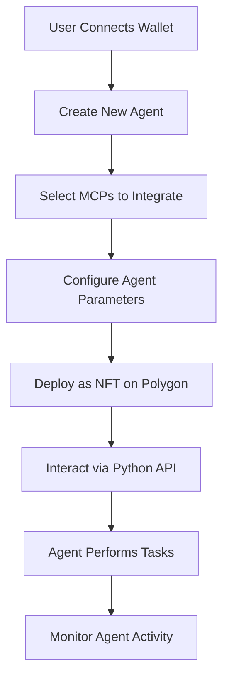

# AgentActs.eth - Decentralized AI Agent Platform

!AgentActs (https://dynamic-ai-atelier-5nby.vercel.app/CreateAgent)

**Craft AI agents your way by blending MCPs to build agents that work for you!**

AgentActs.eth is a decentralized platform that enables users to create, customize, and deploy AI agents by combining multiple Multi-Context Protocols (MCPs). These agents can interact with various services and perform complex tasks through simple prompts.

## 🚀 Key Features
- **MCP Integration**: Combine protocols like Google Maps, Twitter, and DeFi services
- **On-Chain Agents**: Agents are deployed as NFTs on Polygon
- **Decentralized Identity**: ENS integration for agent identity management
- **DeFi Capabilities**: 1inch integration for cross-chain swaps and portfolio tracking
- **Scalable Backend**: Dockerized Python API for seamless agent orchestration

## 🛠️ Tech Stack

### Core Technologies
- **Blockchain**: Polygon PoS (Smart Contracts in Solidity)
- **Backend**: Python API (Dockerized for scalability)
- **MCP Servers**: Custom integration with various protocol APIs
- **Frontend**: Next.js with TypeScript and Tailwind CSS

### Partner Integrations
| Partner | Integration Details |
|---------|---------------------|
| [Polygon] | Provides scalable blockchain infrastructure for agent deployment (Contract Address - 0x4b01fb681c18a6fe24f288ce315da7fc75a17a8a)|
| [1inch]   | Enables cross-chain swaps and portfolio tracking via Fusion+ API |
| [ENS]     | Offers decentralized identity management for agents |

## 🔄 User Flow


## 💻 Code Structure
```
/agentacts-eth
├── /Frontend          # Next.js frontend
├── /docker           # Python backend
│   ├── app.py       # FastAPI endpoints
│   └── Dockerfile   # Container configuration
├── /contracts       # Smart contracts
└── README.md
```

## 🏗️ Getting Started

### Prerequisites
- Python 3.9+
- Docker
- MetaMask wallet
- Polygon network RPC URL
- Node.js and npm

### Installation

1. Clone the repository:
```bash
git clone https://github.com/your-repo/agentacts-eth.git
```

2. Set up the Frontend:
```bash
cd Frontend && npm install && npm run dev
```

3. Set up the Python API:
```bash
cd docker && docker build -t agentacts-api . && docker run -p 8000:8000 agentacts-api
```

## 📚 Technical Documentation

### API Endpoints
The backend provides several key endpoints:
- Create chat session
- Send messages
- Get chat session
- IPFS integration for agent configuration

### Frontend Components
Built with Next.js 13+ using:
- TypeScript for type safety
- Tailwind CSS for styling
- Web3 integration with wagmi hooks

## 🔐 Security
- Basic HTTP authentication for API endpoints
- Secure credential verification
- IPFS data fetching with error handling

## 📈 Future Development
- Enhanced MCP integration
- Improved agent interaction capabilities
- Extended blockchain network support

